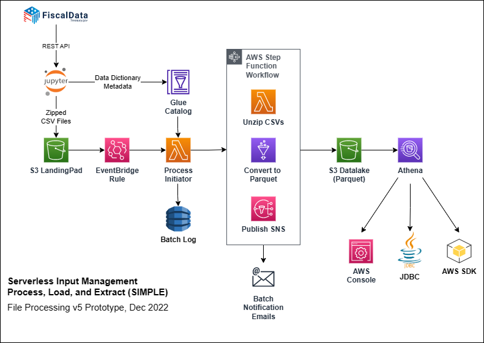

# Serverless Input Management Process, Load, and Extract (SIMPLE)

This **SIMPLE** project demonstrates how to utilize [AWS Serverless Computing](https://aws.amazon.com/serverless/) technologies to ingest, process, and query data received via Managed File Transfer (MFT) or other means.  Public data extracted via REST API from the [FiscalData](https://fiscaldata.treasury.gov/api-documentation/) web site is placed on a Landing Pad which triggers an event to initiate ingest processing to make the data available for downstream processing or analysis. 

**SIMPLE** is completely parameter-driven and in no way application-specific.   Parameters can be entered via the AWS Management Console, supplied via CLI/SDK arguments, or incorporated into CloudFormation templates.  Metadata can be used as the parameter source to achieve complete process automation.

**S3 Landing Pad** -- Amazon **Simple Storage Service (Amazon S3)** is an object storage service that provides scalability, availability, security, and performance.  Data Files are placed in the S3 'Landing Pad' Bucket in a designated Folder that corresponds to File Naming Conventions.   File Naming Conventions, carefully established among Data Exchange Partners, are based upon file name *nodes* (substrings) that identify where and when the file originated, how it needs to be processed, where results need to be sent.   'Inbound' Files can be placed upon the Landing Pad by Managed File Transfer (MFT), application processes, or even uploaded via REST API.  'Outbound' files can be retrieved and transported by MFT, accessed by 'downstream' application processes.

**EventBridge Rule** -- Amazon EventBridge is a serverless event bus that enables event-driven application choreography at scale across AWS services and among other systems.  An **EventBridge Rule** configured for each Landing Pad folder identifies processing 'Targets' to handle files that land in those folders.   

**Process Initiator** -- AWS Lambda is a serverless, event-driven compute service that lets us run code for virtually any type of application or backend service without provisioning or managing servers.  Though EventBridge is capable of directly targeting Step Functions (and many other service types), we use a Lambda function to customize and enhance parameters passed thru it, and to log additional audit information on file processing.

**Step Function Workflow** -- AWS Step Functions provide orchestration services that enable combining various services into workflows that are manageable via Web UI.  This SIMPLE prototype uses a Step Function to Unzip CSVs using Lambda and tranforms them into Parquet format using Glue ETL.  

**S3 Datalake** -- Processed data is stored in an S3 Datalake bucket, where it can be accessed directly using or imported into Redshift data warehouse using typical SQL commands via various interfaces.

**Query-in-Place with Athena**
-   AWS Console
-   Rest API 
-   JDBC with IAM Credentials

 

## Jupyter Notebooks
[Jupyter Notebook](https://realpython.com/jupyter-notebook-introduction/) is an open source web application that you can use to create and share documents that contain live code, equations, visualizations, and text. This SIMPLE prototype uses Jupyter Notebooks to demonstrate and execute a variety of code samples which enable you to build the serverless infrastructure and use it to process demo data.

Jupyter Notebooks can be deployed into [Amazon SageMaker Notebook Instances](https://docs.aws.amazon.com/sagemaker/latest/dg/nbi.html) to provide an executable hosting environment. [MicroSoft Visual Studio Code (VS Code)](https://code.visualstudio.com/docs/datascience/jupyter-notebooks) supports working with Jupyter Notebooks natively.  VS Code can be set up on a bastion host, or configured local using IAM credentials.

- [ci-cd/code_sync.ipynb](ci-cd/code_sync.ipynb) -- CloudFormation and other utilities you can use to set up your own SIMPLE sample for fun and learning.  (AWS Account with Poweruser Privileges required.)
- [data/get_fiscaldata.ipynb](data/get_fiscaldata.ipynb) -- Demonstrates how to use Python and AWS SDK for Python (boto3) to download public information available via REST APIs.
- [eventbridge/eventbridge_workbook.ipynb](eventbridge/eventbridge_workbook.ipynb) -- Describes how to set up EventBridge Rules for Landing Pad folders, providing custom parameters for process initiation.  
- [glue/glue_workbook.ipynb](glue/glue_workbook.ipynb) -- Contains utilities to create Tables in Glue Catalog based on metadata from the data source.  Also, how to launch and monitor Glue ETL jobs.

 

## Additional Contents
The SIMPLE project also includes the following folders, in addition those which contain Jupyter Notebooks:

- [common](common) -- Python common code modules than can be imported into Notebooks, Glue ETL jobs, Lambda Layers, SageMaker, EMR.
- [lambda](lambda) -- Lambda function source code and ZIP file deployment packages.
- [stepfunctions](stepfunctions) -- Step Function state machines definitions.

